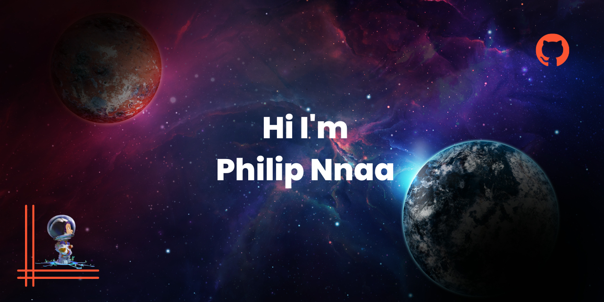

ls

<h2 align="center">A Software Engineer |Tech Enthusiast</h2>

  

  

- 🔭 I’m currently working on <ul>
<li>**a clone of the AirBnB web app**</li>
<li>**The Fyyur Music App**</li>
</ul>

- 🌱 I’m currently learning **Javascript**

- 💬 Ask me about **Anything in my stack**

- 📫 How to reach me: **philipnnaa@outlook.com**

- ⚡ Fun fact: **I'm a student of the ALX Software Engineering Programme (cohort 5)**

<h3 align="left">Connect with me:</h3>

<!---->

<h3 align="left">Languages and Tools:</h3>

    <a href="https://git-scm.com/" target="_blank" rel="noreferrer"> <img src="https://www.vectorlogo.zone/logos/git-scm/git-scm-icon.svg" alt="git"
 

